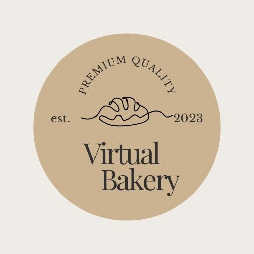

# WIRTUALNA PIEKARNIA

Zobacz projekt [Virtual Bakery](https://youtu.be/kGKepKRuDWk).

Aplikacja webowa, mająca na celu zademonstrowanie moich umiejętności pisania kodu.
Umożliwia zamawianie świeżego pieczywa oraz daty dostawy.

**Właściwości**:
- wybór pieczywa
- wybór ilości
- wybór daty

## 💡 Technologie

&nbsp;

## 💿 Instalacja

Projekt używa  [node](https://nodejs.org/en/) oraz [npm](https://www.npmjs.com/). Aby zainstalować wpisz w terminal: `npm i`.

&nbsp;

## 💭 Plany na przyszłość

- Rozbudować bazę danych
- Dodać tabelę dla klientów
- Dodać tabelę dla dostawców
- Dodać panel administratora
- Bezpieczne szyfrowanie haseł

&nbsp;

## 🙋‍♂️ Zapraszam do kontaktu
Mój email: katarzynabarska58@gmail.com

